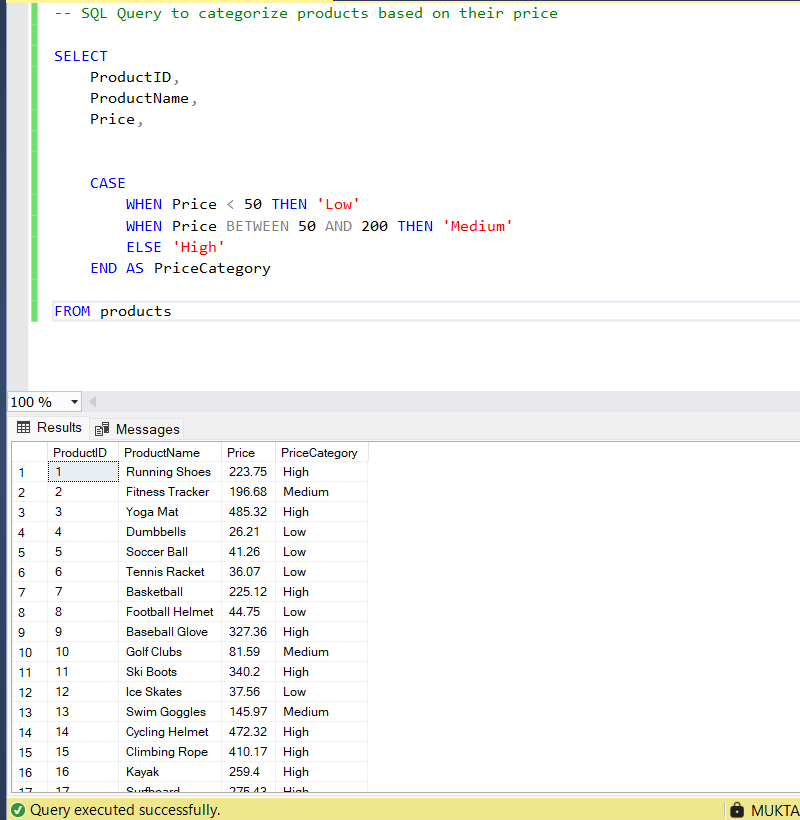
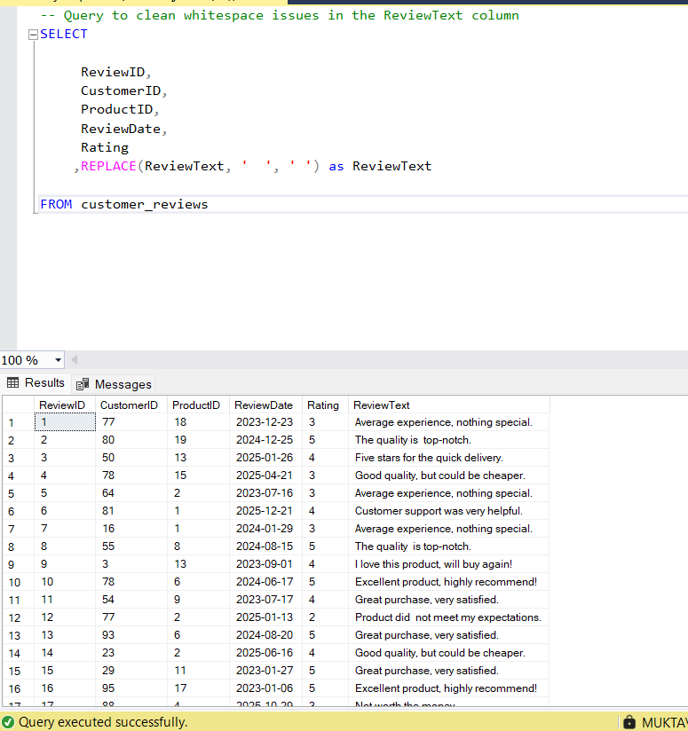
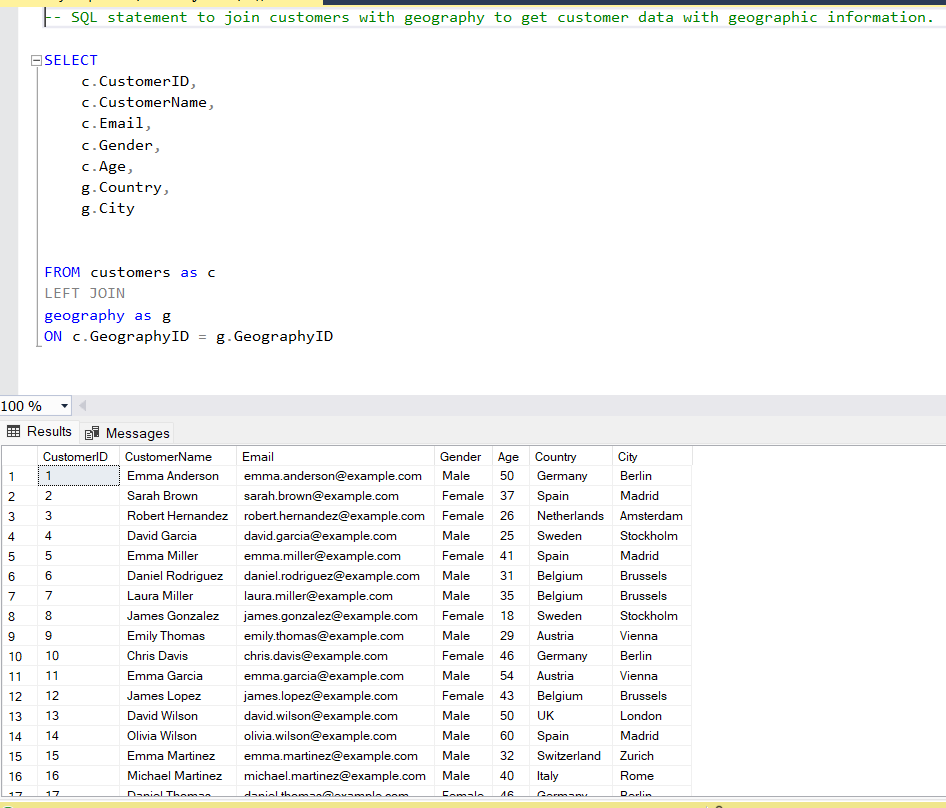
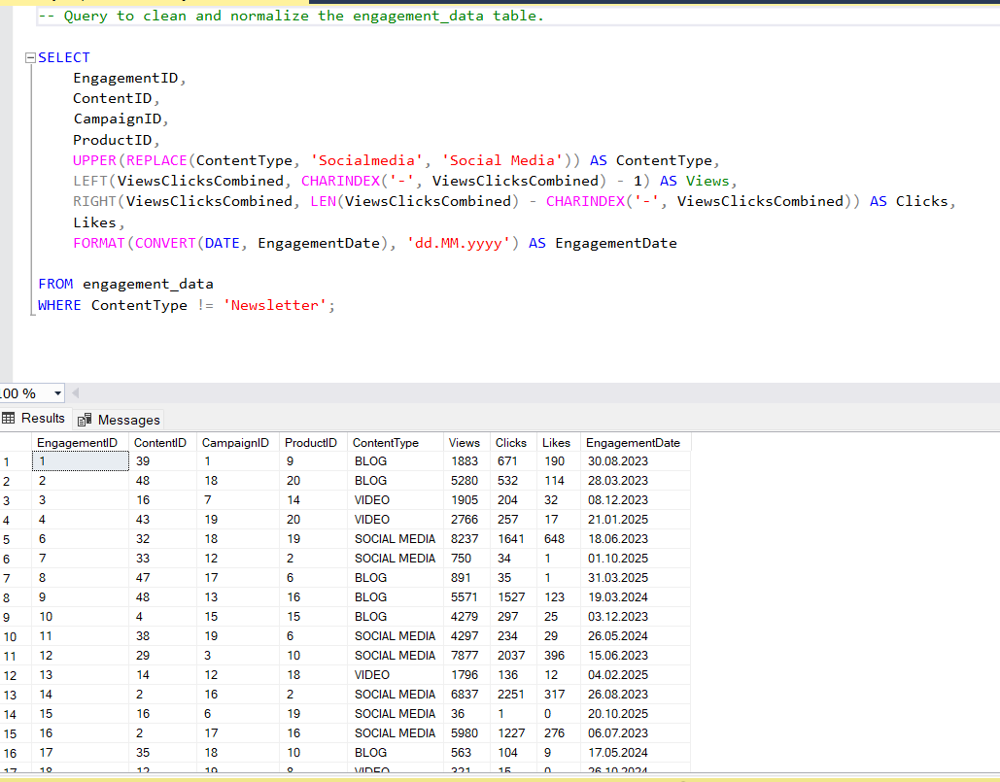
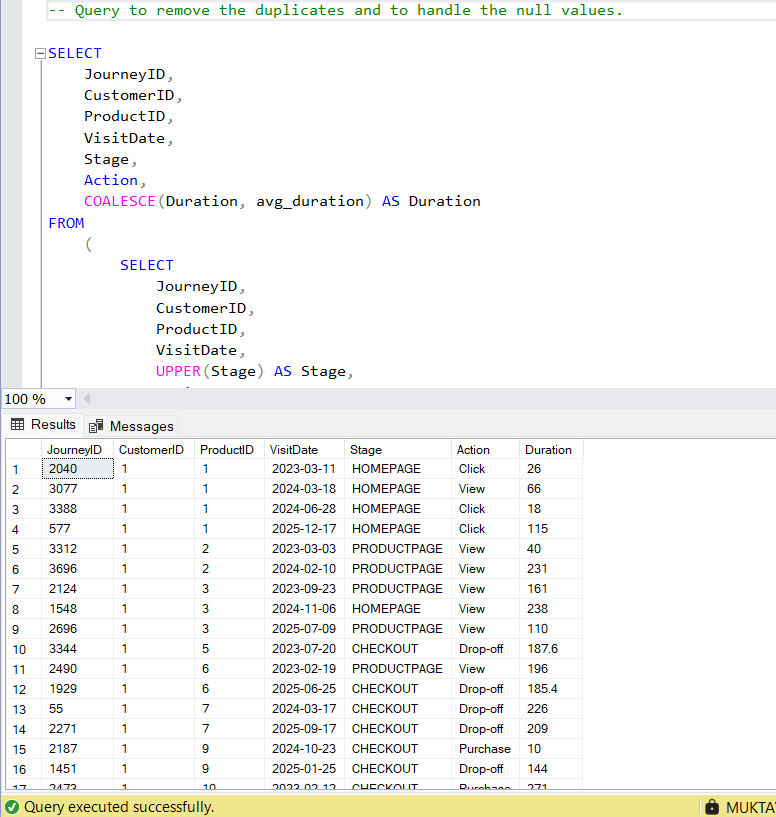
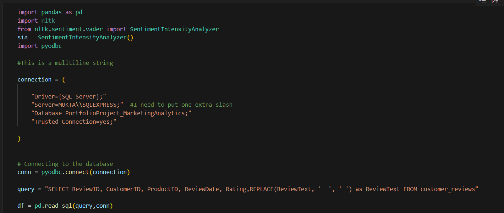
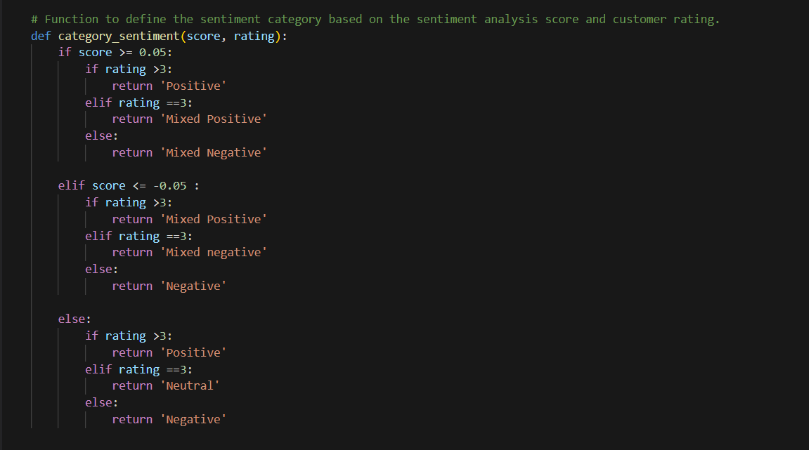
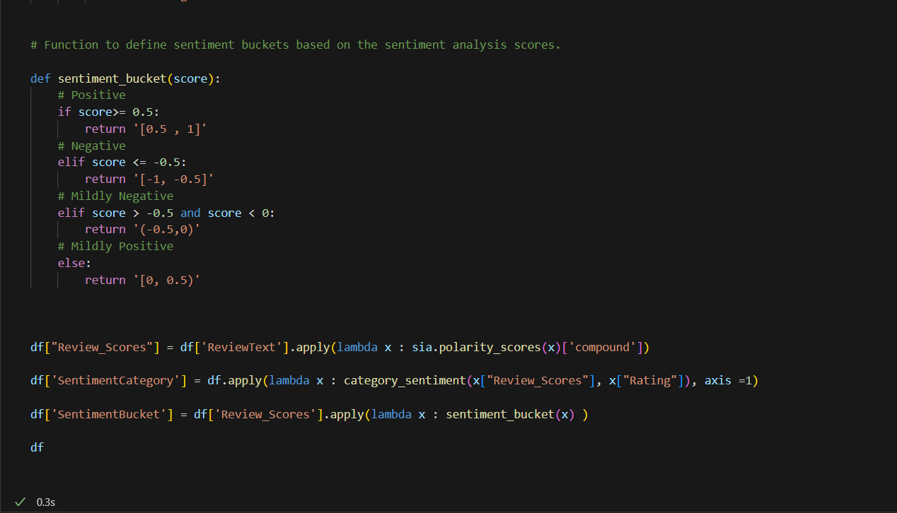
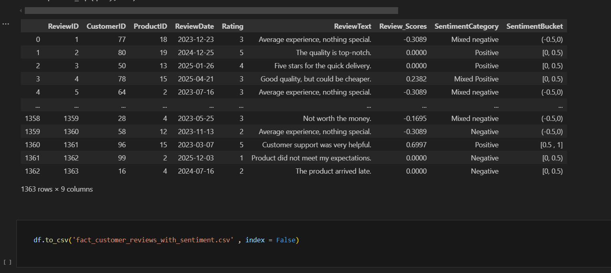

# Marketing Analytics Exploration

## Overview
This project involves a comprehensive analysis of customer feedback and social media comments to uncover key pain points, understand customer needs, and optimize marketing strategies for improved engagement and conversion rates.

## Key Points
- **Reduced Customer Engagement**: The number of customer interactions and engagement with the site and marketing content has declined.
- **Decreased Conversion Rates** : Fewer site visitors are converting into paying customers.
- **High Marketing Expenses** : Significant investments in marketing campaigns are not yielding expected returns.
- **Need for Customer Feedback Analysis** : Understanding customer opinions about products and services is crucial for improving engagement and conversions.

## Technologies Used
-**SQL** : 
 * Restored data from a .bak file, cleaned the dataset, removed duplicates, and handled missing values.
   
-**Python** : 
 * Used Pyodbc library to connect to the database.
 * Used pandas to execute SQL queries and convert the query results directly into a DataFrame for further analysis and processing.
 * Used nltk library to import SentimentIntensityAnalyzer to perform Sentiment Analysis.
 * Used pandas again, to covert the final Dataframe into a csv file.
   
-**PowerBI** :
 * Used SQL queries to clean and transform data within Power BI (including removing duplicates and handling null values).
 * Applied DAX for advanced calculations, enabling the creation of interactive and dynamic visualizations.
 * Integrated data from Excel (generated from Python sentiment analysis) to build a comprehensive dashboard, providing valuable reporting and insights.

## Key Performance Indicators (KPIs)
- **Conversion Rate** : Percentage of website visitors who make a purchase.
- **Customer Engagement Rate** : Level of interaction with marketing content (clicks, likes, comments).
- **Customer Feedback Score** : Average rating from customer reviews.

## DASHBOARD | PowerBI

/Dashboard(1).png)

/Dashboard(2).png)

/Dashboard(3).png)

/Dashboard(4).png)

---

## SQL

* **Query-1**
  

* **Query-2**

* **Query-3**

* **Query-4**

* **Query-5**

---

## Sentiment Analysis | Python

  

   

  
